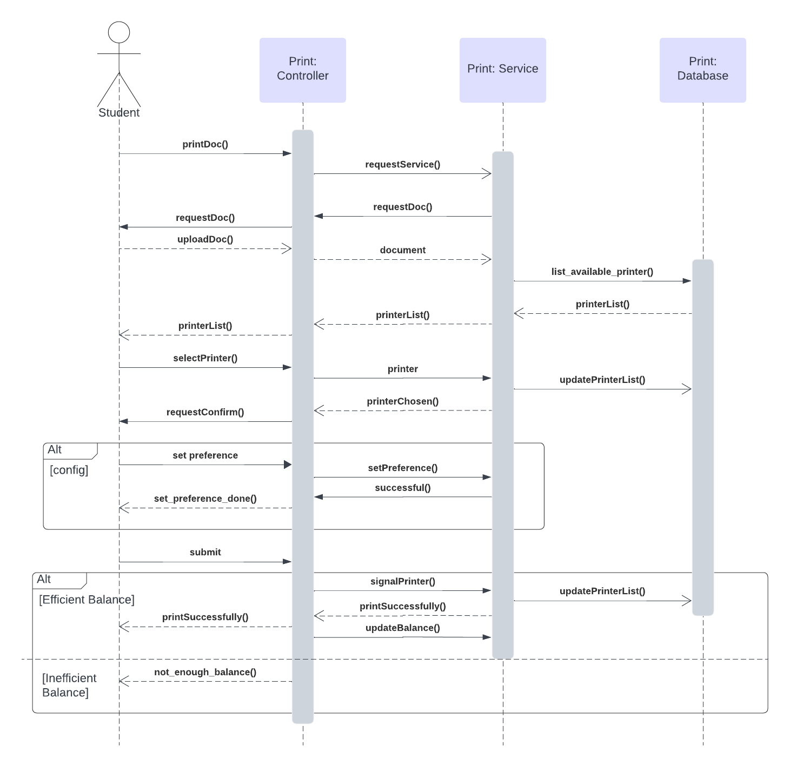

# HCMUT_SSPS - STUDENT SMART PRINTING SERVICE at HCMUT

## Descriptions:

The university is intent to build a Student Smart Printing Service (HCMUT_SSPS) for serving students in its campuses to print their documents.

The system consists of some printers around the campuses. Each printer has ID, brand/manufacturer name, printer model, short description, and the location (campus name, building name, and room number).

The system allows a student to print a document by uploading a document file onto the system, choose a printer, and specifying the printing properties such as paper size, pages (of the file) to be printed, one-/double-sided, number of copies, etc. The permitted file types are limitted and configured by the Student Printing Service Officer (SPSO).

The system has to log the printing actions for all students, including student ID, printer ID, filename, printing start and end time, number of pages for each page size.

The system allows the SPSO to view the printing history (log) of all students or a student for atime period (date to date) and for all or some printers. Of course, a student can also view his/her printing log for a time period together with a summary of number of printed pages for each
page size.

For each semester, the university give each student a default number of A4-size pages forprinting. Students are allowed to buy some more using the feature Buy Printing Pages of the system and pay the amount through some online payment system like the BKPay system of the university. The system only allow a student to print some number of pages when it does not exceed his/her account (page) balance. Note that, one A3 page is equivalent to two A4 pages.

The SPSO has a feature to manage printers such as add/enable/disable a printer.

The SPSO also has a feature to manage other configuration of the system such as changing the default number of pages, the dates that the system will give the default number of pages to all students, the permitted file types accepted by the system.

The reports of the using of the printing system are generated automatically at the end of each month and each year and are stored in the system, and can be viewed by the SPSO anytime.

All users have to be authenticated by the HCMUT_SSO authentication service before using the
system.

The system are provided through a web-based app and a mobile app.

## Features

Here are some diagrams showing features and stakeholders of the system.

### Use Case Diagram

The system is implemented mainly on a web application platform, so there will be a general use-case diagram as follows

### Activity Diagram

**Description:** 

• Student signs into the system.

• Student uploads documents, configures settings and chooses a printer while the system saves the documents, settings and sends them to the designated printer respectively.

• Student presses ”Print”.

• If student doesn’t have enough printing paper,

    – System displays interface to assist student with either reducing pages printed or buying more printing paper.
    – Student finishes these actions and ensures that they have enough printing paper.

• Printer starts printing after receiving documents and settings.

• System logs the activity, deletes saved documents from both the system and the printer, and sends status notification to the student.

• Student receives status notification.

### Sequence Diagram

**Description**

• Student presses Print Document

• The controller then requests printing service and displays request document from the Student

• The student uploads his/her document, it is kept in Service Component and will be used as a parameter of printing function

• The Service retrieves a list of printers available and return the list to the Student

• The Student selects one of the printers.

• The system updates status of this printer in the Database, while the printer chosen is signaled and set ready

• The Controller requests confirmation from Student

• If the student wants to set preference for the pages to print, he/she can do it at this confirmation phase

• The student selects submit the action

• If the student’s balance is efficient, signal Printer to print and update the status of this printer on the Database at the same time, then display ”Printed Successfully” notification

• If the student’s balance is inefficient, display a warning ”Not enough balance” and suggest
him/her to buy some more pages.

### Class Diagram

## Installation

## Using the system

## Credit

