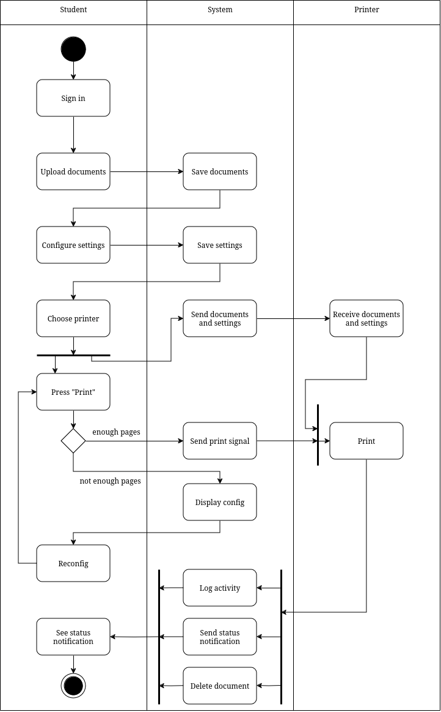

# HCMUT_SSPS - STUDENT SMART PRINTING SERVICE at HCMUT

## Table of Content:

- [HCMUT\_SSPS - STUDENT SMART PRINTING SERVICE at HCMUT](#hcmut_ssps---student-smart-printing-service-at-hcmut)
  - [Table of Content:](#table-of-content)
  - [Descriptions:](#descriptions)
  - [Features](#features)
    - [Use Case Diagram](#use-case-diagram)
    - [Activity Diagram](#activity-diagram)
    - [Sequence Diagram](#sequence-diagram)
    - [Class Diagram](#class-diagram)
  - [Installation](#installation)
    - [Prerequisite](#prerequisite)
    - [Clone project](#clone-project)
    - [Build project](#build-project)
  - [Using the system](#using-the-system)
  - [Credit](#credit)
## Descriptions:

The university is intent to build a Student Smart Printing Service (HCMUT_SSPS) for serving students in its campuses to print their documents.

The system consists of some printers around the campuses. Each printer has ID, brand/manufacturer name, printer model, short description, and the location (campus name, building name, and room number).

The system allows a student to print a document by uploading a document file onto the system, choose a printer, and specifying the printing properties such as paper size, pages (of the file) to be printed, one-/double-sided, number of copies, etc. The permitted file types are limitted and configured by the Student Printing Service Officer (SPSO).

The system has to log the printing actions for all students, including student ID, printer ID, filename, printing start and end time, number of pages for each page size.

The system allows the SPSO to view the printing history (log) of all students or a student for atime period (date to date) and for all or some printers. Of course, a student can also view his/her printing log for a time period together with a summary of number of printed pages for each
page size.

For each semester, the university give each student a default number of A4-size pages forprinting. Students are allowed to buy some more using the feature Buy Printing Pages of the system and pay the amount through some online payment system like the BKPay system of the university. The system only allow a student to print some number of pages when it does not exceed his/her account (page) balance. Note that, one A3 page is equivalent to two A4 pages.

The SPSO has a feature to manage printers such as add/enable/disable a printer.

The SPSO also has a feature to manage other configuration of the system such as changing the default number of pages, the dates that the system will give the default number of pages to all students, the permitted file types accepted by the system.

The reports of the using of the printing system are generated automatically at the end of each month and each year and are stored in the system, and can be viewed by the SPSO anytime.

All users have to be authenticated by the HCMUT_SSO authentication service before using the
system.

The system are provided through a web-based app and a mobile app.

## Features

Here are some diagrams showing features and stakeholders of the system.

### Use Case Diagram

The system is implemented mainly on a web application platform, so there will be a general use-case diagram as follows


### Activity Diagram



**Description:** 

• Student signs into the system.

• Student uploads documents, configures settings and chooses a printer while the system saves the documents, settings and sends them to the designated printer respectively.

• Student presses ”Print”.

• If student doesn’t have enough printing paper,

    – System displays interface to assist student with either reducing pages printed or buying more printing paper.
    – Student finishes these actions and ensures that they have enough printing paper.

• Printer starts printing after receiving documents and settings.

• System logs the activity, deletes saved documents from both the system and the printer, and sends status notification to the student.

• Student receives status notification.

### Sequence Diagram


**Description**

• User presses Upload Document

• The Controller component forwards the document to the Service component

• If the document is invalid, it returns an error which indicates ”Invalid document” then exits the flow.

• If it is a valid document, the Service component will call ”Store document” function in the Repository component to store the document in the component. It will then be inserted into the database. When completed, the Database component returns acknowledgment from the insert to the Repository component, which returns acknowledgment from the store operation to the Service.

• After that, the Service Component returns acknowledgment from the ”Save document” message following that the Upload successful is returned to the user. User will then choose the printer to print that document.

• The controller passes the message to the Service Component. It will then passes the message to Repository component and the Repository then call that function inside the Database component. Once it finds the printer. It will return the message to the upper layer and display it to the user.

• User sends the Print request to Controller component. It then saves the setting into Service. After that, the Controller component calls function Validate print request from the Service component. Within the validation, it checks available pages in the Repository component, whose values are match with the Users’ value. It then queries the balance from the database and returns page balance of the User to Service Component.

• If the user has enough page balance, the Service will send Document data to the printer and
the printer will print. After printing, the Printer returns the message indicating completion.
### Class Diagram


## Installation

To use the application, follow these steps:

### Prerequisite

Before running the project, install [*Docker Desktop*](https://www.docker.com/) and [*Nodejs*](https://nodejs.org/en)

### Clone project 

Open your terminal, "cd" your folder that you want to clone your project to, then run this command:

```
git clone https://github.com/QuanCters/swe-assignment.git
```
### Build project

Inside your cloned project, open your terminal and run the following command:
```
docker compose build
```

## Using the system

To run the project, open your terminal and run the following command:

```
docker compose up
```

## Credit

This project is contributed by the members of group Calculus 8:
- Nguyễn Bảo Trâm - 2213572
- Nguyễn Minh Quân - 2212804
- Nguyễn Minh Toàn - 2213533
- Phan Đình Khôi Nguyên - 2212318
- Lê Hoàng Tiến - 2213455

